P8106-Midterm
================
2026-03-24

``` r
if (!dir.exists("figures")) dir.create("figures")
if (!dir.exists("tables")) dir.create("tables")
```

``` r
library(ggplot2)
library(caret)
```

    ## Warning: package 'caret' was built under R version 4.5.2

    ## Loading required package: lattice

``` r
library(patchwork)
library(glmnet)
```

    ## Warning: package 'glmnet' was built under R version 4.5.2

    ## Loading required package: Matrix

    ## Loaded glmnet 4.1-10

``` r
library(tidyverse)
```

    ## Warning: package 'dplyr' was built under R version 4.5.2

    ## ── Attaching core tidyverse packages ──────────────────────── tidyverse 2.0.0 ──
    ## ✔ dplyr     1.2.0     ✔ readr     2.1.5
    ## ✔ forcats   1.0.0     ✔ stringr   1.5.1
    ## ✔ lubridate 1.9.4     ✔ tibble    3.3.0
    ## ✔ purrr     1.1.0     ✔ tidyr     1.3.1

    ## ── Conflicts ────────────────────────────────────────── tidyverse_conflicts() ──
    ## ✖ tidyr::expand() masks Matrix::expand()
    ## ✖ dplyr::filter() masks stats::filter()
    ## ✖ dplyr::lag()    masks stats::lag()
    ## ✖ purrr::lift()   masks caret::lift()
    ## ✖ tidyr::pack()   masks Matrix::pack()
    ## ✖ tidyr::unpack() masks Matrix::unpack()
    ## ℹ Use the conflicted package (<http://conflicted.r-lib.org/>) to force all conflicts to become errors

``` r
library(corrplot)
```

    ## Warning: package 'corrplot' was built under R version 4.5.3

    ## corrplot 0.95 loaded

``` r
library(mgcv)
```

    ## Loading required package: nlme
    ## 
    ## Attaching package: 'nlme'
    ## 
    ## The following object is masked from 'package:dplyr':
    ## 
    ##     collapse
    ## 
    ## This is mgcv 1.9-3. For overview type 'help("mgcv-package")'.

``` r
library(earth)
```

    ## Warning: package 'earth' was built under R version 4.5.2

    ## Loading required package: Formula

    ## Warning: package 'Formula' was built under R version 4.5.2

    ## Loading required package: plotmo

    ## Warning: package 'plotmo' was built under R version 4.5.2

    ## Loading required package: plotrix

    ## Warning: package 'plotrix' was built under R version 4.5.2

``` r
library(randomForest)
```

    ## Warning: package 'randomForest' was built under R version 4.5.2

    ## randomForest 4.7-1.2
    ## Type rfNews() to see new features/changes/bug fixes.
    ## 
    ## Attaching package: 'randomForest'
    ## 
    ## The following object is masked from 'package:dplyr':
    ## 
    ##     combine
    ## 
    ## The following object is masked from 'package:ggplot2':
    ## 
    ##     margin

``` r
library(xgboost)
```

    ## Warning: package 'xgboost' was built under R version 4.5.3

``` r
library(gam)
```

    ## Warning: package 'gam' was built under R version 4.5.3

    ## Loading required package: splines
    ## Loading required package: foreach
    ## 
    ## Attaching package: 'foreach'
    ## 
    ## The following objects are masked from 'package:purrr':
    ## 
    ##     accumulate, when
    ## 
    ## Loaded gam 1.22-7
    ## 
    ## 
    ## Attaching package: 'gam'
    ## 
    ## The following objects are masked from 'package:mgcv':
    ## 
    ##     gam, gam.control, gam.fit, s

``` r
set.seed(123)
```

``` r
# load data
load("datA.RData")

str(datA)
```

    ## 'data.frame':    2000 obs. of  17 variables:
    ##  $ id              : chr  "A0001" "A0002" "A0003" "A0004" ...
    ##  $ age             : num  61.2 42 56.7 54 47 25 46.2 42.8 56.4 49.3 ...
    ##  $ menopause       : int  1 0 1 1 0 0 0 0 1 1 ...
    ##  $ race            : int  1 1 1 1 3 1 1 3 1 1 ...
    ##  $ bmi             : num  31.8 24 34.4 18.7 22.2 27.1 28.9 27 28.8 29.5 ...
    ##  $ tumor_size      : num  4.8 4.3 4.5 5.1 2.2 4.8 1.5 3 2.7 1.7 ...
    ##  $ tumor_grade     : int  3 3 1 2 1 3 2 2 1 2 ...
    ##  $ lymph_nodes     : int  6 2 2 11 0 6 0 1 0 1 ...
    ##  $ ER              : int  1 1 1 1 0 0 1 1 0 1 ...
    ##  $ PR              : int  1 1 1 1 0 0 1 1 0 1 ...
    ##  $ HER2            : int  0 0 1 0 0 0 0 0 1 0 ...
    ##  $ Ki67            : num  27.6 22.7 5 15.6 23.1 45.9 17.5 27.1 24.7 16.4 ...
    ##  $ stage           : int  3 3 2 3 1 3 1 1 2 1 ...
    ##  $ surgery         : int  1 0 0 1 0 0 0 0 1 0 ...
    ##  $ chemo           : int  1 1 0 1 1 0 0 0 1 0 ...
    ##  $ hormonal_therapy: int  1 0 1 1 0 0 1 1 0 1 ...
    ##  $ log_PFS         : num  1.33 2.13 1.61 2.59 4.08 ...

``` r
# check missing value
sum(is.na(datA))
```

    ## [1] 0

# EDA

``` r
# check y distribution
p <- ggplot(datA, aes(x = log_PFS)) +
  geom_histogram(bins = 30) +
  theme_minimal()

ggsave("figures/logPFS_hist.png", plot = p, width = 6, height = 4, dpi = 300)
```

``` r
# numerical variables
eda_numeric <- function(data, var, response = "log_PFS", save_plot = TRUE, out_dir = "figures") {

  
  # Histogram
  p_hist <- ggplot(data, aes(x = .data[[var]])) +
    geom_histogram(fill = "lightblue", color = "white", bins = 30) +
    labs(title = paste("Histogram of", var), x = var, y = "Frequency") +
    theme_minimal()
  
  # Boxplot
  p_box <- ggplot(data, aes(y = .data[[var]])) +
    geom_boxplot(fill = "green4") +
    labs(title = paste("Boxplot of", var), y = var) +
    theme_minimal() +
    theme(axis.text.x = element_blank(), axis.ticks.x = element_blank()) 
  
  # Scatter plot
  p_scatter <- ggplot(data, aes(x = .data[[var]], y = .data[[response]])) +
    geom_point(alpha = 0.3, color = "darkblue") +
    geom_smooth(method = "loess", color = "red") +
    labs(title = paste(var, "vs", response), x = var, y = response) +
    theme_minimal()
  
  combined_plot <- (p_hist | p_box) / p_scatter +
    plot_annotation(tag_levels = 'A')
  
  print(combined_plot)
  
  if (save_plot) {
    ggsave(
      filename = file.path(out_dir, paste0("EDA_numeric_", var, ".png")),
      plot = combined_plot,
      width = 10,
      height = 8,
      dpi = 300
    )
  }
}
```

``` r
# categorical variables
eda_categorical <- function(data, var, response = "log_PFS", save_plot = TRUE, out_dir = "figures") {
  boxplot(data[[response]] ~ data[[var]],
          main = paste("Boxplot of", response, "by", var),
          xlab = var,
          ylab = response,
          col = "lightgreen")
  
  if (save_plot) {
    png(
      filename = file.path(out_dir, paste0("EDA_categorical_", var, ".png")),
      width = 900,
      height = 700,
      res = 120
    )
  }
  
  boxplot(data[[response]] ~ data[[var]],
          main = paste("Boxplot of", response, "by", var),
          xlab = var,
          ylab = response,
          col = "lightgreen")
  
  if (save_plot) dev.off()
}
```

``` r
numeric_vars <- c("age", "bmi", "tumor_size", "lymph_nodes", "Ki67")
categorical_vars <- c("menopause", "race", "tumor_grade", "ER", "PR", 
                      "HER2", "stage", "surgery", "chemo", "hormonal_therapy")
```

``` r
for (v in numeric_vars) {
  eda_numeric(datA, v)
}
```

    ## `geom_smooth()` using formula = 'y ~ x'
    ## `geom_smooth()` using formula = 'y ~ x'

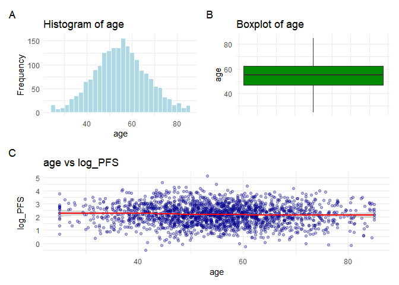<!-- -->

    ## `geom_smooth()` using formula = 'y ~ x'
    ## `geom_smooth()` using formula = 'y ~ x'

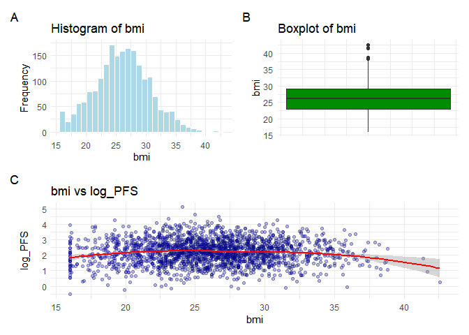<!-- -->

    ## `geom_smooth()` using formula = 'y ~ x'
    ## `geom_smooth()` using formula = 'y ~ x'

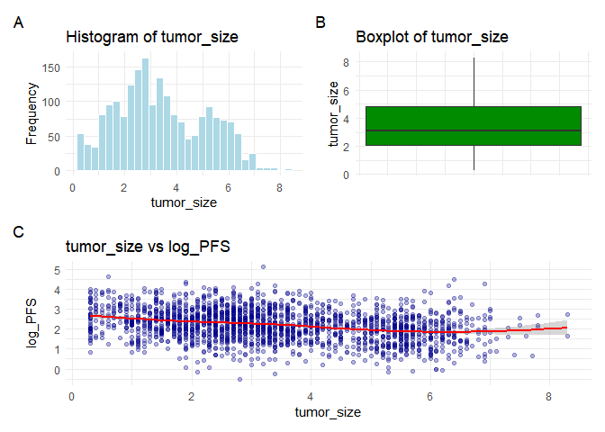<!-- -->

    ## `geom_smooth()` using formula = 'y ~ x'
    ## `geom_smooth()` using formula = 'y ~ x'

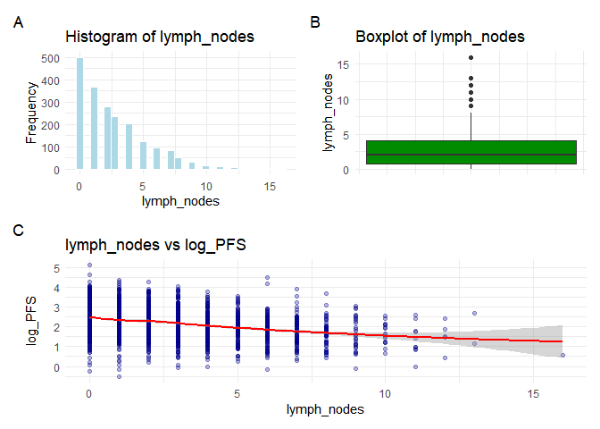<!-- -->

    ## `geom_smooth()` using formula = 'y ~ x'
    ## `geom_smooth()` using formula = 'y ~ x'

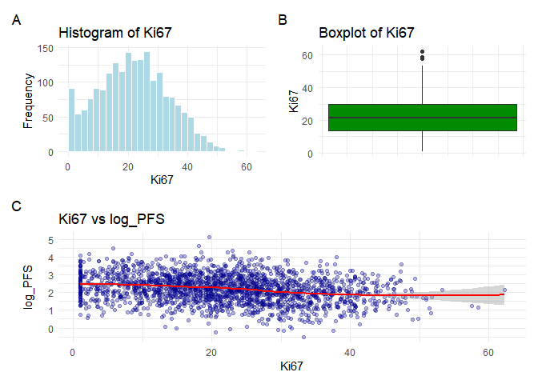<!-- -->

``` r
for (v in categorical_vars) {
  eda_categorical(datA, v)
}
```

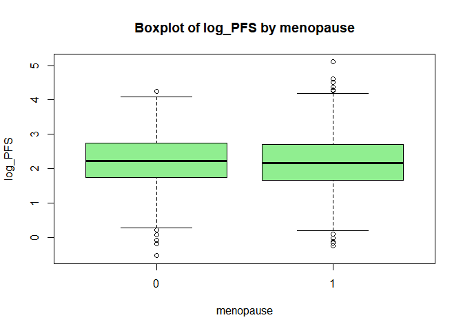<!-- -->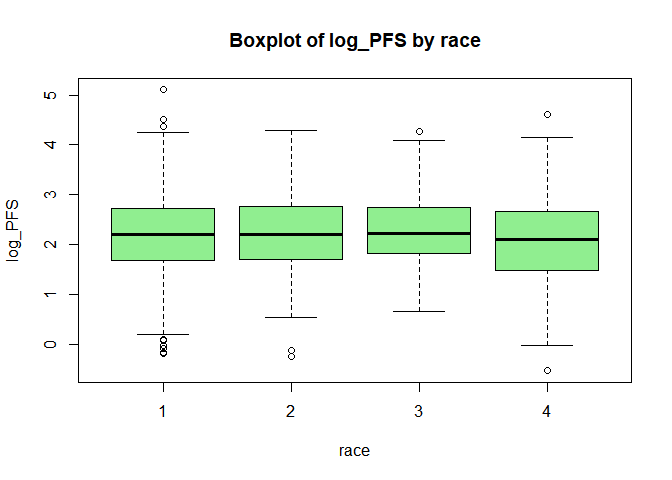<!-- -->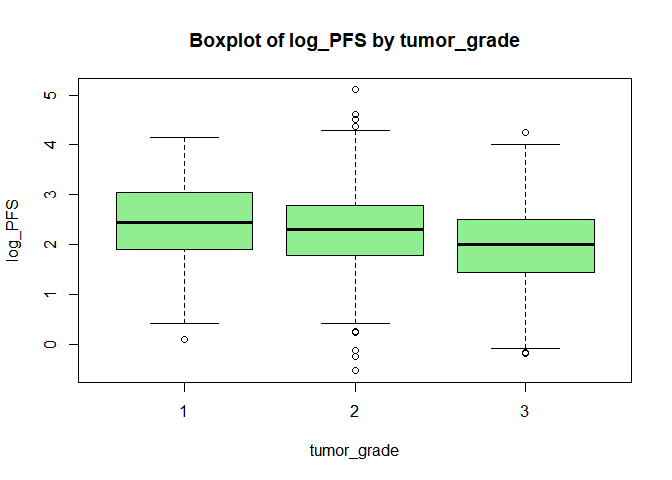<!-- -->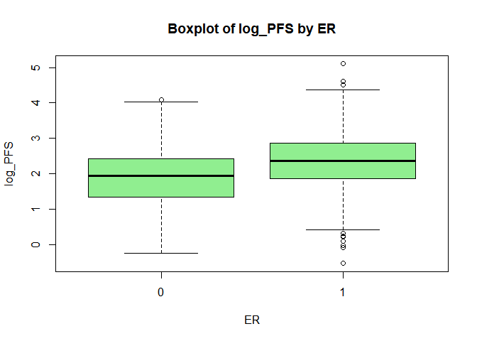<!-- -->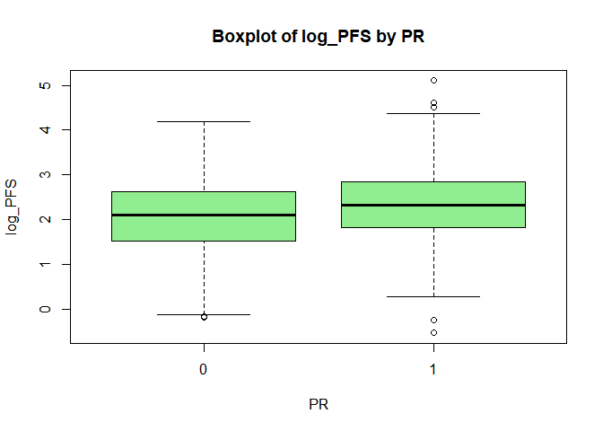<!-- -->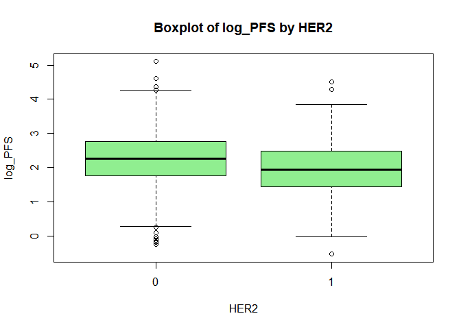<!-- -->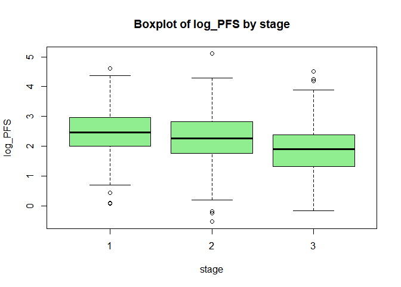<!-- -->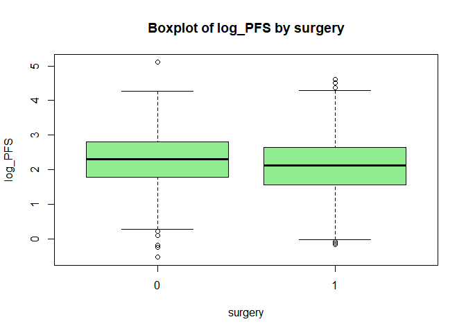<!-- -->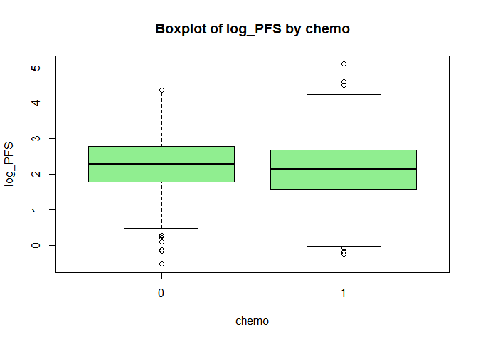<!-- -->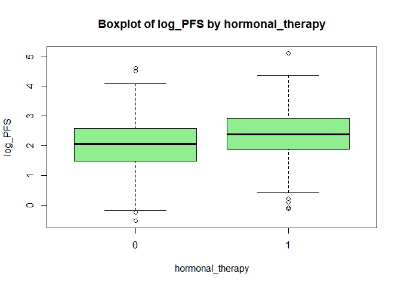<!-- -->

### Correlation

``` r
numeric_data <- datA[, numeric_vars]
cor_matrix <- cor(numeric_data, use = "complete.obs")
cor_matrix 
```

    ##                     age         bmi tumor_size lymph_nodes        Ki67
    ## age          1.00000000  0.08077314 0.01855446  0.05970366 -0.04257004
    ## bmi          0.08077314  1.00000000 0.03323924  0.03105259 -0.03638665
    ## tumor_size   0.01855446  0.03323924 1.00000000  0.70632086  0.15023485
    ## lymph_nodes  0.05970366  0.03105259 0.70632086  1.00000000  0.14087906
    ## Ki67        -0.04257004 -0.03638665 0.15023485  0.14087906  1.00000000

``` r
plot_corr <- function() {
  corrplot(cor_matrix, method = "color", type = "upper",
         addCoef.col = "black",  # show numbers
         tl.col = "black", tl.srt = 45)
}

plot_corr()
```

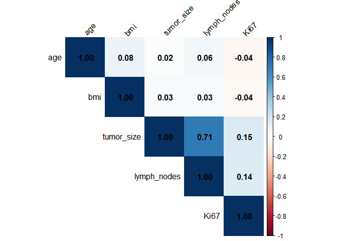<!-- -->

``` r
png("figures/correlation_plot.png", width = 800, height = 600, res = 120)
plot_corr()
invisible(dev.off())
```

# Model fitting A

``` r
# feature matrix
x <- model.matrix(log_PFS ~ . - id, data = datA)[, -1]
y <- datA$log_PFS
```

``` r
# cross validation setup
ctrl <- trainControl(
  method = "repeatedcv",
  number = 10,
  repeats = 5
)
```

### Linear regression

``` r
lm_fit <- train(
  x, y,
  method = "lm",
  trControl = ctrl,
  preProcess = c("center", "scale")
)
```

### LASSO1

``` r
lasso_fit <- train(
  x, y,
  method = "glmnet",
  trControl = ctrl,
  preProcess = c("center", "scale"),
  tuneGrid = expand.grid(
    alpha = 1,
    lambda = 10^seq(-3, 0, length = 30)
  )
)
```

    ## Warning in nominalTrainWorkflow(x = x, y = y, wts = weights, info = trainInfo,
    ## : There were missing values in resampled performance measures.

``` r
coef_lasso <- coef(lasso_fit$finalModel, s = lasso_fit$bestTune$lambda)

coef_df <- as.matrix(coef_lasso)
coef_df <- data.frame(
  variable = rownames(coef_df),
  coefficient = coef_df[, 1]
)

coef_df <- coef_df[coef_df$coefficient != 0, ]
coef_df <- coef_df[coef_df$variable != "(Intercept)", ]

coef_df
```

    ##                          variable coefficient
    ## age                           age -0.02385346
    ## tumor_size             tumor_size -0.08197431
    ## tumor_grade           tumor_grade -0.05564052
    ## lymph_nodes           lymph_nodes -0.15588575
    ## ER                             ER  0.11341883
    ## HER2                         HER2 -0.06220669
    ## Ki67                         Ki67 -0.04014182
    ## hormonal_therapy hormonal_therapy  0.06065163

### LASSO2

``` r
lasso2 <- train(
  log_PFS ~ 
      tumor_size + I(tumor_size^2) +
      lymph_nodes + I(lymph_nodes^2) +
      tumor_size:lymph_nodes +
      age +
      Ki67 + I(Ki67^2) +
      tumor_grade +
      ER + HER2 + hormonal_therapy,
  data = datA,
  method = "glmnet",
  tuneGrid = expand.grid(alpha = 1, lambda = 10^seq(-3, -1, length = 20)),
  trControl = ctrl
)
```

### LASSO3

``` r
lasso3 <- train(
  log_PFS ~ 
      tumor_size +
      lymph_nodes +
      tumor_size:lymph_nodes +
      age +
      Ki67 +
      tumor_grade +
      ER + HER2 + hormonal_therapy,
  data = datA,
  method = "glmnet",
  tuneGrid = expand.grid(alpha = 1, lambda = 10^seq(-3, -1, length = 20)),
  trControl = ctrl
)
```

### Elastic net

``` r
enet_fit <- train(
  x, y,
  method = "glmnet",
  trControl = ctrl,
  preProcess = c("center", "scale"),
  tuneGrid = expand.grid(
    alpha = seq(0, 1, by = 0.1),
    lambda = 10^seq(-4, 1, length = 50)
  )
)
```

    ## Warning in nominalTrainWorkflow(x = x, y = y, wts = weights, info = trainInfo,
    ## : There were missing values in resampled performance measures.

### GAM

``` r
gam_fit <- train(
  x, y,
  method = "gamSpline",
  trControl = ctrl,
  preProcess = c("center", "scale"),
  tuneLength = 10
)
```

### MARS

``` r
mars_fit <- train(
  x, y,
  method = "earth",
  trControl = ctrl,
  preProcess = c("center", "scale"),
  tuneGrid = expand.grid(
    degree = 1:3,
    nprune = seq(5, 50, by = 5)
  )
)
```

### Polynomial regression

``` r
poly_fit <- train(
  log_PFS ~ 
                  tumor_size + I(tumor_size^2) +
                  log(lymph_nodes + 1) +
                  tumor_size:lymph_nodes +
                  age +
                  log(Ki67 + 1) +
                  tumor_grade +
                  ER + HER2 + hormonal_therapy,
                data = datA,
  method = "lm",
  trControl = ctrl
)
```

``` r
library(gridExtra)
```

    ## 
    ## Attaching package: 'gridExtra'

    ## The following object is masked from 'package:randomForest':
    ## 
    ##     combine

    ## The following object is masked from 'package:dplyr':
    ## 
    ##     combine

``` r
library(grid)

results <- resamples(list(
  Linear = lm_fit,
  Lasso1 = lasso_fit,
  Lasso2 = lasso2,
  Lasso3 = lasso3,
  ElasticNet = enet_fit,
  GAM = gam_fit,
  MARS = mars_fit,
  poly = poly_fit 
))

summary(results)
```

    ## 
    ## Call:
    ## summary.resamples(object = results)
    ## 
    ## Models: Linear, Lasso1, Lasso2, Lasso3, ElasticNet, GAM, MARS, poly 
    ## Number of resamples: 50 
    ## 
    ## MAE 
    ##                 Min.   1st Qu.    Median      Mean   3rd Qu.      Max. NA's
    ## Linear     0.5228782 0.5390971 0.5633561 0.5621438 0.5783974 0.6532096    0
    ## Lasso1     0.4934741 0.5491318 0.5624906 0.5612673 0.5793310 0.5989955    0
    ## Lasso2     0.5132140 0.5460346 0.5637159 0.5615703 0.5787178 0.5945311    0
    ## Lasso3     0.5210029 0.5493470 0.5619030 0.5608639 0.5705139 0.6190415    0
    ## ElasticNet 0.5112826 0.5466045 0.5633548 0.5612691 0.5742682 0.5964541    0
    ## GAM        0.5075370 0.5447021 0.5600761 0.5607898 0.5727146 0.6117915    0
    ## MARS       0.4947542 0.5474051 0.5662013 0.5643046 0.5824456 0.6168420    0
    ## poly       0.5054755 0.5444179 0.5645070 0.5610363 0.5793705 0.6217516    0
    ## 
    ## RMSE 
    ##                 Min.   1st Qu.    Median      Mean   3rd Qu.      Max. NA's
    ## Linear     0.6492735 0.6764665 0.7025537 0.7027740 0.7226985 0.8157221    0
    ## Lasso1     0.6247285 0.6851636 0.7029633 0.7011757 0.7216105 0.7474565    0
    ## Lasso2     0.6437318 0.6863234 0.7031744 0.7018581 0.7224001 0.7408930    0
    ## Lasso3     0.6463126 0.6827967 0.7030270 0.7011143 0.7167470 0.7727896    0
    ## ElasticNet 0.6284010 0.6774408 0.7021910 0.7010717 0.7266637 0.7489662    0
    ## GAM        0.6221659 0.6804564 0.6967582 0.6989344 0.7196959 0.7603407    0
    ## MARS       0.6213739 0.6842019 0.7011820 0.7021521 0.7229313 0.7793607    0
    ## poly       0.6176352 0.6770164 0.7017963 0.7007312 0.7200001 0.7819832    0
    ## 
    ## Rsquared 
    ##                  Min.   1st Qu.    Median      Mean   3rd Qu.      Max. NA's
    ## Linear     0.08131285 0.1587894 0.1985976 0.1974950 0.2255513 0.3411058    0
    ## Lasso1     0.07525030 0.1637501 0.1961648 0.2023806 0.2420278 0.3314762    0
    ## Lasso2     0.09759545 0.1607235 0.1937312 0.2000148 0.2388578 0.2930032    0
    ## Lasso3     0.09425283 0.1726289 0.1936254 0.2000121 0.2253937 0.2936190    0
    ## ElasticNet 0.10231472 0.1789015 0.2019908 0.2003707 0.2293380 0.2889712    0
    ## GAM        0.08731292 0.1762246 0.2108072 0.2065858 0.2426930 0.2991534    0
    ## MARS       0.12509975 0.1653958 0.1915743 0.1999983 0.2266094 0.3009029    0
    ## poly       0.10299805 0.1759051 0.1928779 0.2017438 0.2386260 0.3362550    0

``` r
bwplot(results)
```

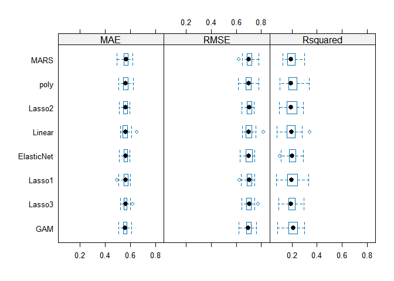<!-- -->

``` r
dotplot(results)
```

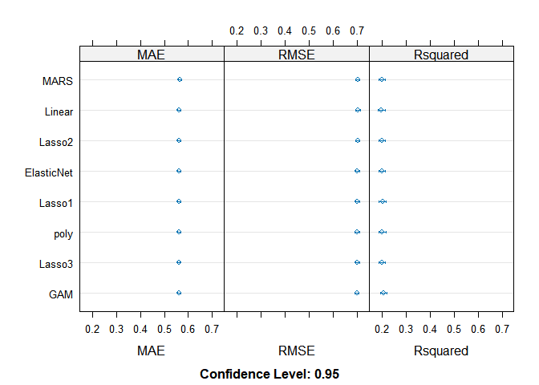<!-- -->

``` r
sum_res <- summary(results)
png("tables/resample_RMSE.png", width = 1200, height = 700)
grid.table(as.data.frame(sum_res$statistics$RMSE))
invisible(dev.off())

png("tables/resample_Rsquared.png", width = 1200, height = 700)
grid.table(as.data.frame(sum_res$statistics$Rsquared))
invisible(dev.off())

p_bw <- bwplot(results)
png("figures/bwplot_results.png", width = 1000, height = 700)
print(p_bw)
invisible(dev.off())

p_dot <- dotplot(results)
png("figures/dotplot_results.png", width = 1000, height = 700)
print(p_dot)
invisible(dev.off())
```

``` r
model_list <- list(
  Lasso1 = lasso_fit,
  Lasso2 = lasso2,
  Lasso3 = lasso3,
  ElasticNet = enet_fit,
  GAM = gam_fit,
  MARS = mars_fit,
  poly = poly_fit
)

lapply(model_list, function(x) x$bestTune)
```

    ## $Lasso1
    ##    alpha     lambda
    ## 11     1 0.01082637
    ## 
    ## $Lasso2
    ##   alpha      lambda
    ## 7     1 0.004281332
    ## 
    ## $Lasso3
    ##   alpha      lambda
    ## 3     1 0.001623777
    ## 
    ## $ElasticNet
    ##     alpha     lambda
    ## 471   0.9 0.01098541
    ## 
    ## $GAM
    ##         df
    ## 7 2.333333
    ## 
    ## $MARS
    ##   nprune degree
    ## 4     20      1
    ## 
    ## $poly
    ##   intercept
    ## 1      TRUE

``` r
best_tune_df <- bind_rows(
  lapply(names(model_list), function(nm) {
    df <- as.data.frame(model_list[[nm]]$bestTune)
    df$Model <- nm
    df
  })
)

best_tune_df <- best_tune_df[, c("Model", setdiff(names(best_tune_df), "Model"))]
png("tables/best_tune_models.png", width = 1400, height = 700, res = 150)
grid.table(best_tune_df)
invisible(dev.off())
```

# Fit data B

``` r
# load data
load("datB.RData")
```

``` r
pred_B <- predict(gam_fit, newdata = datB)

postResample(pred = pred_B, obs = datB$log_PFS)
```

    ##      RMSE  Rsquared       MAE 
    ## 0.8406603 0.1621410 0.6843138

``` r
#feature matrix
x <- model.matrix(log_PFS ~ . - id, data = datB)[, -1]
y <- datB$log_PFS
```

``` r
#cross validation setup
ctrl <- trainControl(
  method = "repeatedcv",
  number = 10,
  repeats = 5
)
```

### Linear regression

``` r
lm_fit <- train(
  x, y,
  method = "lm",
  trControl = ctrl,
  preProcess = c("center", "scale")
)
```

### LASSO

``` r
lasso_fit <- train(
  x, y,
  method = "glmnet",
  trControl = ctrl,
  preProcess = c("center", "scale"),
  tuneGrid = expand.grid(
    alpha = 1,
    lambda = 10^seq(-3, 0, length = 30)
  )
)
```

    ## Warning in nominalTrainWorkflow(x = x, y = y, wts = weights, info = trainInfo,
    ## : There were missing values in resampled performance measures.

### LASSO2

``` r
lasso2 <- train(
  log_PFS ~
      tumor_size + I(tumor_size^2) +
      lymph_nodes + I(lymph_nodes^2) +
      tumor_size:lymph_nodes +
      age +
      Ki67 + I(Ki67^2) +
      tumor_grade +
      ER + HER2 + hormonal_therapy,
  data = datB,
  method = "glmnet",
  tuneGrid = expand.grid(alpha = 1, lambda = 10^seq(-3, -1, length = 20)),
  trControl = ctrl
)
```

### LASSO3

``` r
lasso3 <- train(
  log_PFS ~
      tumor_size +
      lymph_nodes +
      tumor_size:lymph_nodes +
      age +
      Ki67 +
      tumor_grade +
      ER + HER2 + hormonal_therapy,
  data = datB,
  method = "glmnet",
  tuneGrid = expand.grid(alpha = 1, lambda = 10^seq(-3, -1, length = 20)),
  trControl = ctrl
)
```

### Elastic net

``` r
enet_fit <- train(
  x, y,
  method = "glmnet",
  trControl = ctrl,
  preProcess = c("center", "scale"),
  tuneGrid = expand.grid(
    alpha = seq(0, 1, by = 0.1),
    lambda = 10^seq(-4, 1, length = 50)
  )
)
```

    ## Warning in nominalTrainWorkflow(x = x, y = y, wts = weights, info = trainInfo,
    ## : There were missing values in resampled performance measures.

### GAM

``` r
gam_fit <- train(
  x, y,
  method = "gamSpline",
  trControl = ctrl,
  preProcess = c("center", "scale"),
  tuneLength = 10
)
```

### MARS

``` r
mars_fit <- train(
  x, y,
  method = "earth",
  trControl = ctrl,
  preProcess = c("center", "scale"),
  tuneGrid = expand.grid(
    degree = 1:3,
    nprune = seq(5, 50, by = 5)
  )
)
```

### Polynomial regression

``` r
 poly_fit <- train(
   log_PFS ~
                tumor_size + I(tumor_size^2) +
                   log(lymph_nodes + 1) +
                   tumor_size:lymph_nodes +
                   age +
                   log(Ki67 + 1) +
                   tumor_grade +
                   ER + HER2 + hormonal_therapy,
                 data = datB,
   method = "lm",
   trControl = ctrl
)
```

``` r
if (!dir.exists("resultB")) dir.create("resultB")

library(gridExtra)
library(grid)

results <- resamples(list(
  Linear = lm_fit,
  Lasso1 = lasso_fit,
  Lasso2 = lasso2,
  Lasso3 = lasso3,
  ElasticNet = enet_fit,
  GAM = gam_fit,
  MARS = mars_fit,
  poly = poly_fit 
))

summary(results)
```

    ## 
    ## Call:
    ## summary.resamples(object = results)
    ## 
    ## Models: Linear, Lasso1, Lasso2, Lasso3, ElasticNet, GAM, MARS, poly 
    ## Number of resamples: 50 
    ## 
    ## MAE 
    ##                 Min.   1st Qu.    Median      Mean   3rd Qu.      Max. NA's
    ## Linear     0.4867638 0.5280459 0.5347508 0.5377525 0.5472988 0.5869059    0
    ## Lasso1     0.4921573 0.5249275 0.5372404 0.5375011 0.5465139 0.5903128    0
    ## Lasso2     0.4892842 0.5264743 0.5371354 0.5367713 0.5519386 0.5750809    0
    ## Lasso3     0.4833353 0.5215797 0.5369024 0.5361777 0.5481897 0.5801926    0
    ## ElasticNet 0.4961818 0.5232795 0.5396356 0.5373116 0.5545233 0.5877808    0
    ## GAM        0.4773600 0.5150266 0.5382498 0.5350863 0.5517923 0.5808095    0
    ## MARS       0.4883697 0.5163859 0.5378856 0.5349493 0.5498678 0.5875290    0
    ## poly       0.4742068 0.5198758 0.5402248 0.5369227 0.5504947 0.5966277    0
    ## 
    ## RMSE 
    ##                 Min.   1st Qu.    Median      Mean   3rd Qu.      Max. NA's
    ## Linear     0.6071748 0.6582538 0.6800156 0.6757903 0.6894987 0.7471743    0
    ## Lasso1     0.6125606 0.6505729 0.6761071 0.6752450 0.6932142 0.7513296    0
    ## Lasso2     0.6022476 0.6571998 0.6731633 0.6738522 0.6903183 0.7207687    0
    ## Lasso3     0.6279897 0.6509526 0.6720602 0.6731902 0.6952685 0.7310702    0
    ## ElasticNet 0.6095795 0.6510351 0.6787368 0.6747736 0.6928092 0.7440242    0
    ## GAM        0.6028207 0.6489050 0.6735813 0.6710518 0.6917112 0.7391755    0
    ## MARS       0.6170472 0.6527021 0.6709666 0.6704527 0.6890851 0.7320772    0
    ## poly       0.5943381 0.6534023 0.6766063 0.6746189 0.6972112 0.7470272    0
    ## 
    ## Rsquared 
    ##                  Min.   1st Qu.    Median      Mean   3rd Qu.      Max. NA's
    ## Linear     0.07207788 0.1332864 0.1596004 0.1642846 0.1903454 0.2772980    0
    ## Lasso1     0.07984619 0.1403421 0.1675024 0.1642081 0.1890743 0.2534384    0
    ## Lasso2     0.07670082 0.1330974 0.1702988 0.1680499 0.1963304 0.2666594    0
    ## Lasso3     0.09881770 0.1338102 0.1742614 0.1698343 0.2006207 0.2726907    0
    ## ElasticNet 0.05284163 0.1354745 0.1703496 0.1679410 0.2061642 0.2612751    0
    ## GAM        0.07028498 0.1411686 0.1716170 0.1747224 0.2047924 0.2553825    0
    ## MARS       0.11446433 0.1451557 0.1734887 0.1766020 0.1979341 0.2619889    0
    ## poly       0.07878543 0.1445707 0.1595952 0.1649572 0.1821763 0.2576940    0

``` r
bwplot(results)
```

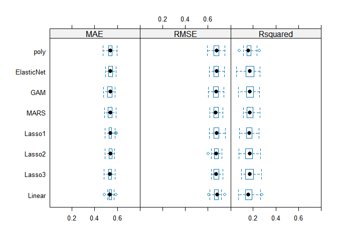<!-- -->

``` r
dotplot(results)
```

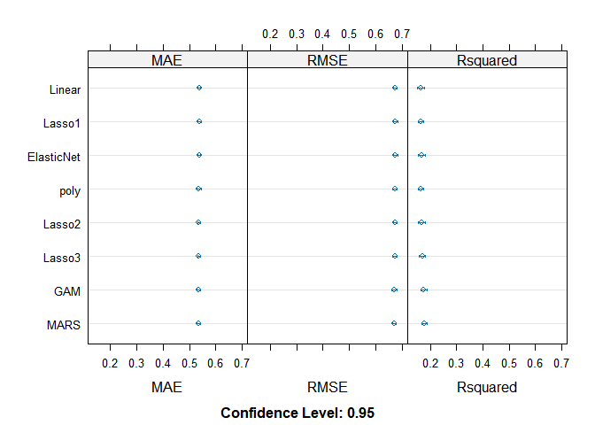<!-- -->

``` r
sum_res <- summary(results)
png("resultB/resample_RMSE_B.png", width = 1200, height = 700)
grid.table(as.data.frame(sum_res$statistics$RMSE))
invisible(dev.off())

png("resultB/resample_Rsquared_B.png", width = 1200, height = 700)
grid.table(as.data.frame(sum_res$statistics$Rsquared))
invisible(dev.off())

p_bw <- bwplot(results)
png("resultB/bwplot_results_B.png", width = 1000, height = 700)
print(p_bw)
invisible(dev.off())

p_dot <- dotplot(results)
png("resultB/dotplot_results_B.png", width = 1000, height = 700)
print(p_dot)
invisible(dev.off())
```
